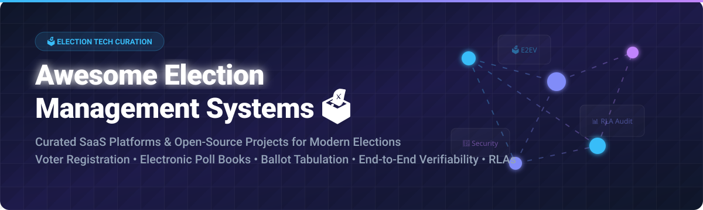

  
  
  
  

  

# 🗳️ Awesome Election Management Systems & Technology Ecosystem

> **Curated List of SaaS Products, Commercial Systems, and Open-Source GitHub Projects for Election Administration, Electronic Poll Books, Ballot Tabulation, Voter Registration, Risk-Limiting Audits (RLA), and End-to-End Verifiable Voting.**

**Last updated:** September 2026

---

## 📌 Executive Summary & Industry Overview

This repository serves as a comprehensive index for **Election Management Software (EMS)**, **civic tech infrastructure**, and **verifiable voting protocols**. Modern election administration encompasses voter roll maintenance, electronic check-in pollbooks, ballot layout design, optical scan tabulation, remote/accessible voting delivery, canvassing, and post-election risk-limiting audits.

---

## 📚 Table of Contents
- [🏢 Commercial & SaaS Election Platforms](#-commercial--saas-election-platforms)
- [🔓 Open-Source GitHub Projects & SDKs](#-open-source-github-projects--sdks)
- [🤝 How to Contribute](#-how-to-contribute)
- [📈 Star History](#-star-history)
- [☕ Support & Sponsorship](#-support--sponsorship)
- [⚠️ Disclaimer](#%EF%B8%8F-disclaimer)

---

## 🏢 Commercial & SaaS Election Platforms

> 💡 **Market Overview & Industry Structure:** The global Election Management Systems (EMS) & Election Technology market is estimated at **$2.2 Billion – $3.5 Billion USD**. The market structure is **moderately to highly concentrated**, dominated by certified hardware/software vendors (such as ES&S, Smartmatic, and KNOWiNK) due to stringent state, federal, and international regulatory certification standards (such as EAC VVSG).

Below is a curated table of leading election management SaaS and hosted platforms, sorted by **Company Size / Valuation / Revenue** in descending order.

| 🏢 Product / Platform | 🛠️ Category & Capabilities | 📊 Company Size / Revenue / Valuation | 💵 Pricing (Starting Tiers) | 🎁 Free Tier / Trial Limit |
| :--- | :--- | :--- | :--- | :--- |
| **[Smartmatic EMS](https://www.smartmatic.com/)** 🗳️ | Global election management software, biometric voter check-in, ballot scanners, and canvass reporting. | **~$230M Annual Revenue** / ~$723M Valuation *(~440 employees)* | Starting at **$1.50 per registered voter** per election cycle; base EMS platform licensing from **$25,000/jurisdiction**. | **30-Day Developer Sandbox** trial limited to sample election data up to 1,000 test ballots. |
| **[Election Systems & Software (ElectionWare)](https://www.essvote.com/)** 🗳️ | Industry-leading election management suite, ballot design, tabulation, and voter card encoding. | **~$150M–$500M Revenue Range** *(~650 employees)* | Starting at **$12,500 base precinct license**; full EMS suite ranges **$2.00–$3.50 per voter**. | **14-Day Admin Demo** limited to 50 test precinct data configurations. |
| **[VoteBuilder / NGP VAN](https://www.ngpvan.com/)** 📢 | Voter database list management, campaign outreach, field canvassing, and voter file maintenance. | **~$144.5M Parent (Bonterra) Rev** / ~$832M Valuation *(~800 employees)* | Starting at **$45/month** for small campaigns (up to 5,000 voter records). | **14-Day Free Trial** limited to 500 voter record lookups and 1 active admin account. |
| **[SOE Software / Scytl](https://www.scytl.com/)** 🌐 | Digital voting, online ballot delivery, election night reporting, and election administration. | **~$75M Annual Revenue** *(~350 employees)* | Starting at **$8,000 per election event**; digital voter credential delivery at **$0.85/voter**. | **30-Day Pilot Portal** trial limited to 200 simulated voter check-ins. |
| **[Clear Ballot (ClearVote)](https://www.clearballot.com/)** 🔍 | Independent optical scanning, ballot auditability, election tabulation, and clear results reporting. | **~$23.9M Total Funding** / ~$25M Est. Revenue *(~100 employees)* | Starting at **$15,000 per jurisdiction** audit package; tabulation suite at **$1.75/voter**. | **30-Day Audit Demo** license supporting up to 500 sample ballot image scans. |
| **[KNOWiNK (Poll Pad)](https://www.knowink.com/)** 📱 | EAC-certified electronic poll book (Poll Pad) for voter check-in, barcode scanning, and poll-place sync. | **~$19.7M Annual Revenue** *(~90 employees)* | Starting at **$1,250 per Poll Pad device** license; county base software at **$3,500/year**. | **30-Day Hardware Eval Kit** with demo software limited to 2 e-pollbook units. |
| **[Tenex Software (Precinct Central)](https://www.tenexsoftware.com/)** 🏛️ | Precinct Central e-pollbooks, voter check-in, poll worker training, and election logistics management. | **~$12.5M Est. Revenue** *(~50 employees)* | Starting at **$950 per precinct license**; annual jurisdiction maintenance at **$2,800/year**. | **14-Day Web Portal** evaluation trial limited to 1 precinct dataset (100 test voters). |
| **[PollChief (VR Systems)](https://www.vrsystems.com/)** 👥 | Poll worker recruitment, assignment tracking, training compliance, and polling site management. | **~$8.5M Est. Revenue** *(~40 employees)* | Starting at **$1,800/year** for worker management tier (up to 250 poll workers). | **30-Day Online Portal** trial with up to 25 test poll worker assignments. |
| **[Democracy Live (OmniBallot)](https://democracylive.com/)** ♿ | Secure cloud ballot delivery, military/overseas electronic voting, and ADA-accessible ballot marking. | **~$1.4M Annual Revenue** *(~20 employees)* | Starting at **$4,500 per election** jurisdiction; **$1.20 per delivered accessible ballot**. | **14-Day Accessibility Demo** portal supporting up to 50 sample voter ballot downloads. |

---

## 🔓 Open-Source GitHub Projects & SDKs

Open-source election software provides critical transparency, risk-limiting audit tools, open data schemas, and cryptographic verifiability SDKs. Below are top open-source projects sorted by **GitHub Star Count** in descending order.

| 📦 Repository / Project | 📝 Description & Focus Area | ⭐ GitHub Stars | ⚖️ License |
| :--- | :--- | :--- | :--- |
| **[Election-Tech-Initiative/electionguard](https://github.com/Election-Tech-Initiative/electionguard)** 🛡️ | Core SDK for End-to-End Verifiable (E2EV) elections using homomorphic encryption and ballot verification. |  | MIT License |
| **[nvkelso/election-geodata](https://github.com/nvkelso/election-geodata)** 🗺️ | Open GIS mapping datasets, precinct shapefiles, and electoral boundary geometry definitions. |  | CC-BY-4.0 |
| **[opencivicdata/ocd-division-ids](https://github.com/opencivicdata/ocd-division-ids)** 🆔 | Open Civic Data identifiers for political divisions and electoral boundary hierarchy standardization. |  | BSD-3-Clause |
| **[Election-Tech-Initiative/electionguard-python](https://github.com/Election-Tech-Initiative/electionguard-python)** 🐍 | Reference Python implementation of the ElectionGuard specification for verifiable tallies and key ceremony. |  | MIT License |
| **[votingworks/arlo](https://github.com/votingworks/arlo)** 📊 | Open-source Risk-Limiting Audit (RLA) web software used by jurisdictions to statistically audit election outcomes. |  | GPL-3.0 |
| **[opencivicdata/scrapers-us-municipal](https://github.com/opencivicdata/scrapers-us-municipal)** 🕸️ | Municipal civic data scrapers for local election info, council agendas, and electoral representatives. |  | BSD-3-Clause |
| **[opencivicdata/pupa](https://github.com/opencivicdata/pupa)** 🐛 | Python framework for scraping, processing, and importing civic and legislative election data. |  | BSD-3-Clause |
| **[votingworks/vxsuite](https://github.com/votingworks/vxsuite)** 🗳️ | Full end-to-end voting system software suite (marking, scanning, tabulating) built by VotingWorks nonprofit. |  | GPL-3.0 |
| **[openelections/openelections-data-us](https://github.com/openelections/openelections-data-us)** 📈 | Standardized, precinct-level election results data for U.S. federal and state elections. |  | MIT License |

---

## 🤝 How to Contribute

Contributions are welcome! Please follow these simple guidelines:

1. 🍴 **Fork** this repository.
2. 📝 **Add or update** entries in `README.md` following the tabular format.
3. 🔗 **Ensure** all links point to authoritative product sites or public repositories.
4. 🚀 **Submit a Pull Request** with a clear explanation of additions.

For more awesome lists, check out [Awesome-Awesome-Awesome](https://github.com/ishandutta2007/Awesome-Awesome-Awesome).

---

## 📈 Star History

---

## ☕ Support & Sponsorship

If you find this curated election technology resource valuable, please consider supporting the project:

- ⭐ **Star** this repository on GitHub.
- 🔀 **Fork** and share with civic tech groups and election researchers.
- 💖 **Sponsor / Buy me a Coffee:** Support ongoing maintenance via the [GitHub Sponsor Dashboard](https://github.com/sponsors/ishandutta2007).

---

## ⚠️ Disclaimer

- This repository is a **community-curated index** for informational and educational purposes.
- Election administration systems are critical infrastructure subject to strict legal, security, and statutory certification requirements (e.g., U.S. EAC VVSG).
- Open-source software listed here should **not** be deployed in production voting environments without authorization and formal certification from official regulatory election authorities.
